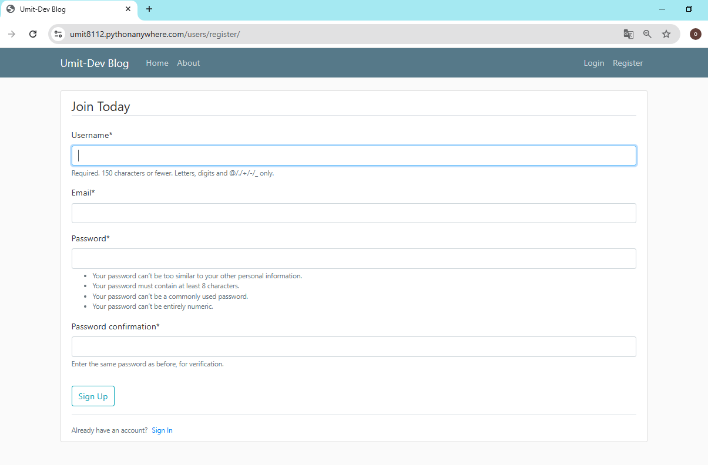
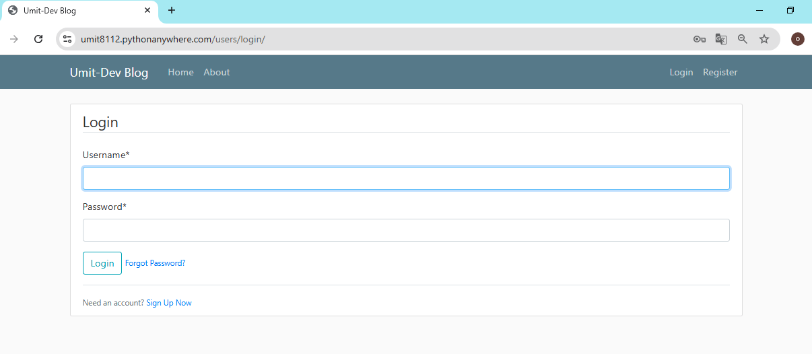
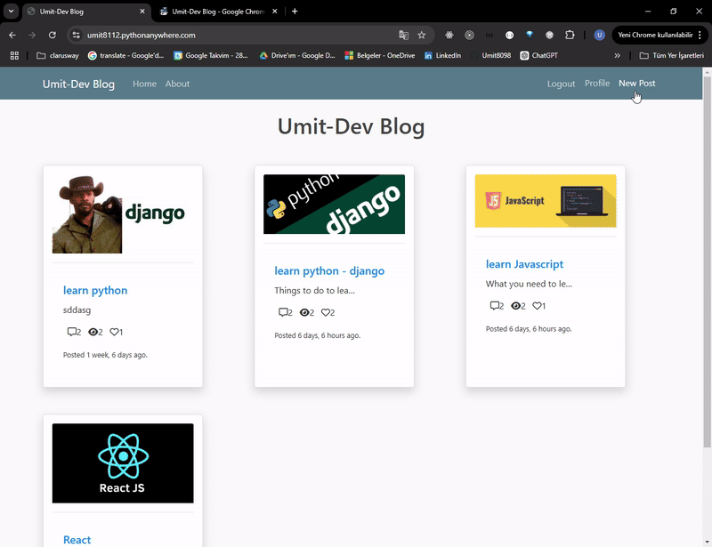
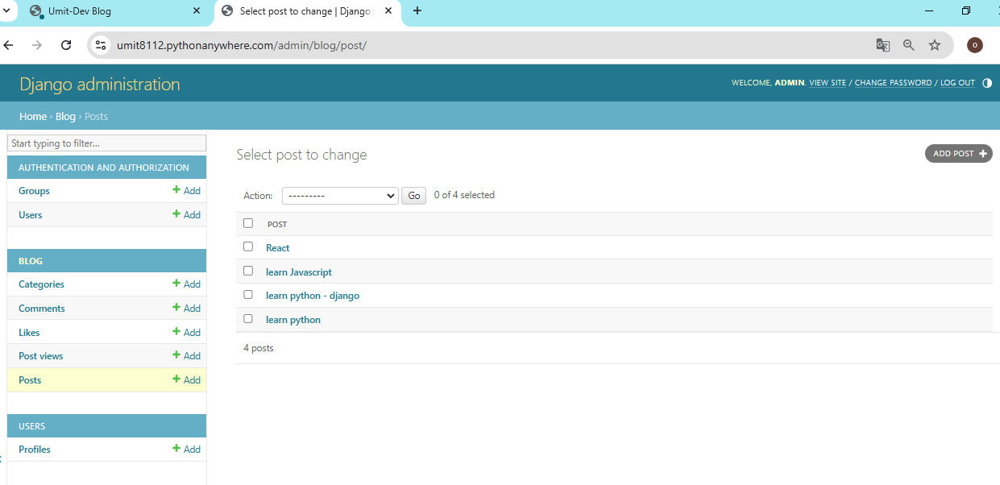
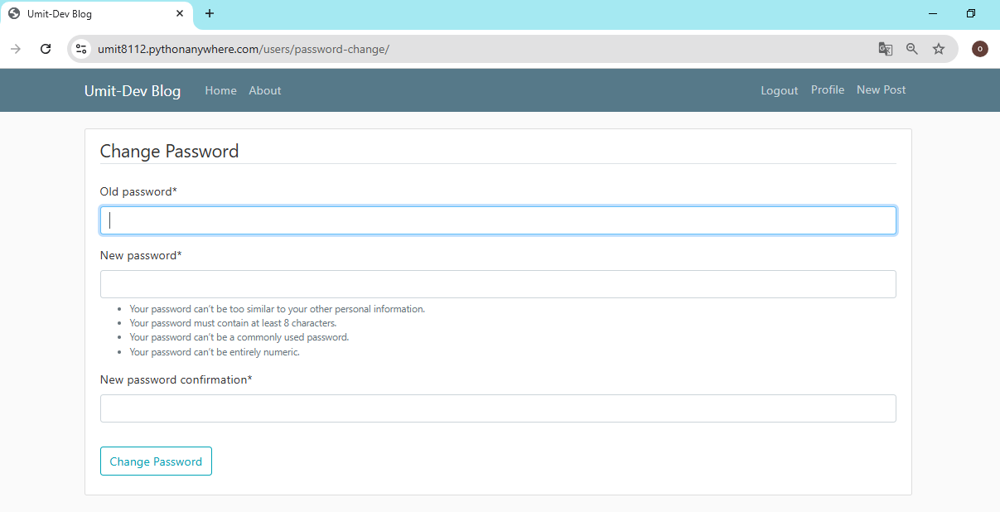
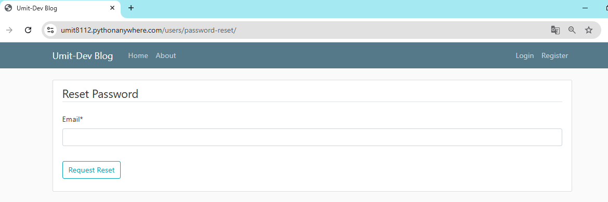

<!-- Please update value in the {}  -->

<h1 align="center">Project_Django_Template_Blog_App</h1>

<p align="center">📝 Django Template Blog App, kullanıcıların blog gönderilerini kolayca oluşturmasını, düzenlemesini ve diğer kullanıcılarla etkileşimde bulunmasını sağlayan bir full-stack uygulamadır. Kullanıcılar, blog gönderileri üzerinde tam kontrol sahibi olabilir ve uygulamanın gelişmiş özelliklerinden yararlanabilirler. 📝</p>


<div align="center">
  <h3>
    <a href="https://umit8112.pythonanywhere.com/">
      Canlı Demo
    </a>
     | 
    <a href="https://github.com/Umit8098/Proj_Django_Temp_Blog_App_CH-8">
      GitHub
    </a>
  </h3>
</div>

<!-- TABLE OF CONTENTS -->

## Table of Contents

- [Table of Contents](#table-of-contents)
- [Overview](#overview)
  - [Kullanıcı Kayıt Olma](#kullanıcı-kayıt-olma)
  - [Kullanıcı Login](#kullanıcı-login)
  - [Blog Gönderileri](#blog-gönderileri)
  - [Kullanıcı Profili](#kullanıcı-profili)
  - [Yönetici Paneli](#yönetici-paneli)
  - [Kullanıcı Password Change](#kullanıcı-password-change)
  - [Kullanıcı Password Reset](#kullanıcı-password-reset)
- [Built With](#built-with)
- [How To Use](#how-to-use)
  - [Test Kullanıcı Bilgileri](#test-kullanıcı-bilgileri)
- [About This Project](#about-this-project)
- [Key Features](#key-features)
- [Contact](#contact)

<!-- OVERVIEW -->
## Overview

- Django Template Blog App, hem frontend hem de backend kısmı Django kullanılarak oluşturulmuş bir blog uygulamasıdır. 
- Bu uygulama aşağıdaki özellikleri sunar:

- Kullanıcılar anonim olarak gönderileri görüntüleyebilir.
- Kayıtlı kullanıcılar:
  - Gönderi oluşturabilir, güncelleyebilir ve silebilir.
  - Gönderilere yorum yapabilir ve beğeni ekleyebilir.
  - Kendi profil bilgilerini düzenleyebilir.
- Şifre unutulması durumunda, kayıtlı e-posta adresine şifre sıfırlama bağlantısı gönderilir.
- Her gönderinin:
  - Beğeni sayısı
  - Görüntülenme sayısı
  - Yorum sayısı görüntülenir.
- Kullanıcılar yapılan işlemler hakkında ekran mesajlarıyla bilgilendirilir.

### Kullanıcı Kayıt Olma
<!--  -->

➡ Kullanıcıların uygulamaya kayıt olma sayfası.

---

### Kullanıcı Login
<!--  -->

➡ Kullanıcıların giriş yaparak blog gönderilerine erişim sağlayabileceği ekran.

---

### Blog Gönderileri
<!--  -->

➡ Blog gönderilerinin genel görünümü.

---

### Kullanıcı Profili
<!--  -->

➡ Kayıtlı kullanıcıların profil düzenleme sayfası.

---

### Yönetici Paneli
<!--  -->

➡ Blog uygulamasının admin panelinden bir görünüm.

---

### Kullanıcı Password Change
<!--  -->

➡ Şifre değiştirme işlemi için kullanılan doğrulama ekranı.

---

### Kullanıcı Password Reset
<!--  -->

➡ Şifre sıfırlama işlemi için e-posta doğrulama ekranı.


## Built With

<!-- This section should list any major frameworks that you built your project using. Here are a few examples.-->
Bu proje aşağıdaki araçlar ve kütüphaneler kullanılarak geliştirilmiştir:

- [Django Templates](https://docs.djangoproject.com/en/5.1/topics/templates/): Dinamik web sayfaları oluşturmak için.
- [Bootstrap4](https://getbootstrap.com/docs/4.6/getting-started/introduction/): Duyarlı ve modern bir kullanıcı arayüzü sağlamak için.
- [django-crispy-forms](https://django-crispy-forms.readthedocs.io/en/latest/): Formları kolayca stilize etmek için.
- [dj-rest-auth](https://dj-rest-auth.readthedocs.io/en/latest/): Kullanıcı doğrulama ve yetkilendirme modülü.


## How To Use

<!-- This is an example, please update according to your application -->

To clone and run this application, you'll need [Git](https://github.com/Umit8098/Proj_Django_Temp_Blog_App_CH-8)

When installing the required packages in the requirements.txt file, review the package differences for windows/macOS/Linux environments. 

Complete the installation by uncommenting the appropriate package.

---

requirements.txt dosyasındaki gerekli paketlerin kurulumu esnasında windows/macOS/Linux ortamları için paket farklılıklarını inceleyin. 

Uygun olan paketi yorumdan kurtararak kurulumu gerçekleştirin.

```bash
# Clone this repository
$ git clone https://github.com/Umit8098/Proj_Django_Temp_Blog_App_CH-8.git

# Install dependencies
    $ python -m venv env
    $ python3 -m venv env (for macOs/linux OS)
    $ env/Scripts/activate (for win OS)
    $ source env/bin/activate (for macOs/linux OS)
    $ pip install -r requirements.txt
    $ python manage.py migrate (for win OS)
    $ python3 manage.py migrate (for macOs/linux OS)

# Create and Edit .env
# Add Your SECRET_KEY in .env file

"""
# example .env;

SECRET_KEY =123456789abcdefg...

# Sending email
EMAIL_HOST = 'smtp.gmail.com'
EMAIL_PORT = 587
EMAIL_HOST_USER = {YOUR EMAIL ADDRESS}
EMAIL_HOST_PASSWORD = {YOUR HOST PASSWORD}
EMAIL_USE_TLS = True

"""


# Run the app
    $ python manage.py runserver
```

### Test Kullanıcı Bilgileri

Canlı demo için aşağıdaki test kullanıcı bilgilerini kullanabilirsiniz:
- **Kullanıcı Adı**: testuser
- **Şifre**: testpassword123


## About This Project
- This project was developed to enable users to easily create, edit blog posts and interact with other users. The application aims to solve the following problems:
- Manage blog posts with a user-friendly interface.
- Advanced features that meet user needs such as password reset and change.
- Both frontend and backend support for CRUD operations.
- Users can view posts anonymously.
- If they want to create a post, comment on the post, or like the post, they must register and log in to the application. After registering, they can update the profile information created for them.
- Users can perform CRUD (Create-Read-Update_Delete) operations.
- The user is notified of the actions taken by a message that appears and disappears on the screen.
- If they have forgotten their login password, an e-mail will be sent to their registered e-mail address so that they can create a login password.
- They can also change their login passwords if they wish.
- Like, view and comment statistics of all posts are displayed.

<hr>

- Bu proje, kullanıcıların blog gönderilerini kolayca oluşturmasını, düzenlemesini ve diğer kullanıcılarla etkileşimde bulunmasını sağlamak için geliştirilmiştir. Uygulama, aşağıdaki sorunları çözmeyi hedefler:
- Kullanıcı dostu bir arayüz ile blog gönderilerini yönetme.
- Şifre sıfırlama ve değiştirme gibi kullanıcı ihtiyaçlarını karşılayan gelişmiş özellikler.
- CRUD işlemleri için hem frontend hem de backend desteği.
- Kullanıcılar anonim olarak gönderileri görüntüleyebilirler.
- Gönderi oluşturmak, gönderiye yorum yazmak, gönderiyi beğenmek isterlerse uygulamaya kayıt olup giriş yapmaları gerekir. Kayıt olduktan sonra kendileri için oluşturulan profil bildilerini güncelleyebiliriler.
- Kullanıcılar CRUD (Create-Read-Update_Delete) işlemleri yapabilir.
- Yaptığı işlemler ekranda belirip kaybolan bir mesajla kullanıcıya bildirilir.
- Eğer giriş şifrelerini unutmuşlarsa, kayıtlı e posta adreslerine giriş şifresi oluşturabilmeleri için posta gönderilir.
- Ayrıca isterlerse giriş şifrelerini değiştirebilirler.
- Tüm gönderilerin beğeni, görüntülenme, yorum istatiktikleri görüntülenmektedir.


## Key Features

- **Gönderi Yönetimi**: Blog gönderilerini görüntüleme, oluşturma, düzenleme ve silme işlemleri.
- **Kullanıcı Yönetimi**: Kayıt, giriş, profil düzenleme, şifre sıfırlama ve değiştirme.
- **Etkileşimler**: Gönderilere yorum yapma ve beğeni ekleme.
- **İstatistikler**: Her gönderi için beğeni, görüntülenme ve yorum sayılarının izlenmesi.
- **Kullanıcı Bildirimleri**: Yapılan işlemler hakkında ekran mesajlarıyla bilgilendirme.


## Contact

<!-- - Website [your-website.com](https://{your-web-site-link}) -->
- **GitHub** [@Umit8098](https://github.com/Umit8098)

- **LinkedIn** [@umit-arat](https://linkedin.com/in/umit-arat/)
<!-- - Twitter [@your-twitter](https://{twitter.com/your-username}) -->


